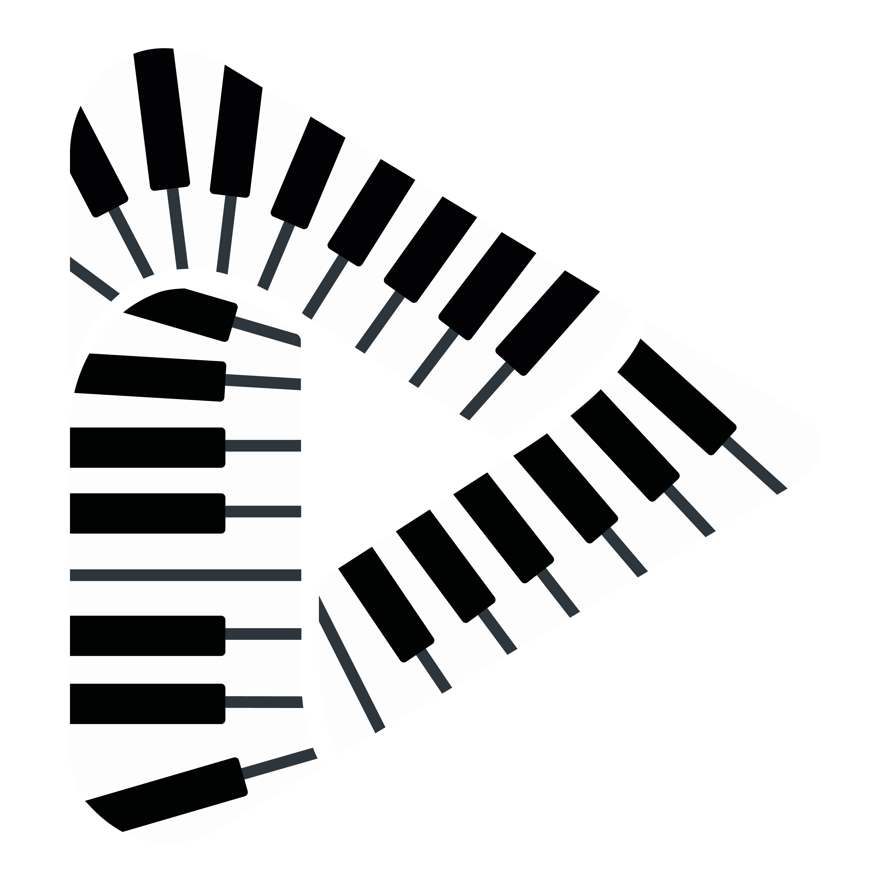

<div align="center">
  

  <h3>🎹 Automated MIDI Piano Player for Games</h3>
  <p><em>Turn any MIDI file into beautiful in-game piano performances</em></p>

  [](https://github.com/nayfusaurus/maestro-keypress/actions)
  [](https://www.python.org/downloads/)
  [](https://opensource.org/licenses/MIT)
  [](https://github.com/nayfusaurus/maestro-keypress/releases/latest)
  [](https://github.com/nayfusaurus/maestro-keypress/releases)
  [](https://claude.ai)

  <p>
    <a href="https://github.com/nayfusaurus/maestro-keypress/releases/latest">📦 Download Latest</a> •
    <a href="#-quick-start">🚀 Quick Start</a> •
    <a href="https://github.com/nayfusaurus/maestro-keypress/issues">🐛 Report Issue</a> •
    <a href="https://ko-fi.com/nayfusaurus">💖 Support</a>
  </p>
</div>

---

## ✨ Highlights

- 🎮 **Multi-game support** - Works with Heartopia, Where Winds Meet, and Once Human
- 🎹 **5 keyboard layouts** - 22-key, 15-key double/triple row, Conga/Cajon drums, Xylophone
- ⚡ **Smart MIDI processing** - Auto-validation, transpose, and compatibility checking
- 🎨 **Modern GUI** - Dark/light themes, icon sidebar navigation, multi-page layout
- 🎵 **YouTube-to-MIDI** - Import songs directly from YouTube URLs
- 🎯 **Event-driven playback** - Precise timing with chord support and MIDI duration tracking
- 🔒 **Production-ready** - 219 tests, type-safe with mypy, security-scanned, pinned dependencies
- 🪟 **Windows executable** - Standalone `.exe` for easy distribution

---

## 🚀 Quick Start

### For End Users (Windows)

1. **[Download the latest release](https://github.com/nayfusaurus/maestro-keypress/releases/latest)** (`Maestro.exe`)
2. **Add MIDI files** to a folder (any `.mid` or `.midi` files)
3. **Run `Maestro.exe`** and select your songs folder
4. **Click Play** (or press **F2**) and watch the magic! ✨

The window auto-minimizes and plays your song after a 3-second countdown.

### For Developers

Requires Python 3.11+ and [uv](https://docs.astral.sh/uv/).

```bash
git clone https://github.com/nayfusaurus/maestro-keypress.git
cd maestro-keypress
uv sync
uv run maestro
```

---

## ⚙️ Features

### 🎵 Playback
- **Event-driven engine** with precise MIDI timing
- **Chord support** - Multiple keys pressed simultaneously
- **Speed control** - 0.5x to 2.0x playback speed
- **Auto-transpose** - Shift out-of-range notes into playable range
- **Sharp handling** - Skip or snap to nearest natural note (15-key layouts)
- **Multi-tempo support** - Handles MIDI files with tempo changes
- **Window focus detection** - Auto-pauses when game window loses focus (Windows)
- **Stuck key protection** - Ensures all keys are released on exit

### 🖥️ User Interface
- **Multi-page layout** - Icon sidebar navigation (Dashboard, Settings, Info, Log)
- **Dark/Light themes** - Catppuccin Mocha (dark) and Latte (light) with toggle switch
- **MIDI validation** - Real-time scan with color-coded status (green/red/gray)
- **Song information** - Duration, BPM, note count, and compatibility percentage
- **Favorites system** - Star your favorite songs (sorted first)
- **Recently played** - Quick access to your last 20 songs
- **Search/filter** - Find songs instantly by name
- **Progress bar** - Visual playback position with time display (M:SS / M:SS)
- **Piano roll preview** - Optional lookahead panel showing upcoming notes
- **Hotkey remapping** - Press-to-bind configuration with conflict detection
- **Settings persistence** - All preferences saved between sessions

### 🎵 Import

- **YouTube-to-MIDI** - Paste a YouTube URL to download and transcribe to MIDI
- **Tuned transcription** - Optimized basic-pitch parameters for in-game piano accuracy
- **Auto-cleanup** - Trims leading silence from transcribed MIDI files

### 🎮 Game Support
- **Heartopia** - 5 keyboard layouts (22-key full, 15-key double/triple, drums, xylophone)
- **Where Winds Meet** - DirectInput support, 36-key (Shift/Ctrl modifiers) and 21-key (naturals only) layouts
- **Once Human** - DirectInput support, single-octave keys with Shift/Ctrl octave switching

### 🛡️ Quality & Performance
- **Event caching** - Reuses built events when only speed changes
- **Incremental validation** - Uses mtime caching to skip unchanged files
- **Type-safe** - Full mypy type checking
- **Security scanned** - pip-audit checks for vulnerabilities (CI)
- **Pinned dependencies** - Locked versions for reproducibility
- **Comprehensive tests** - 312 tests with thorough coverage

---

## 🎮 Supported Games

<details>
<summary><b>Heartopia</b> - 5 Keyboard Layouts</summary>

Uses **pynput** for keyboard simulation. Supports 5 distinct key layouts:

### 22-key (Full) Layout
3 octaves (C3-C6) with sharps/flats. Maps MIDI notes to Heartopia's full piano.

| Octave | DO  | DO# | RE  | RE# | MI  | FA  | FA# | SOL | SOL# | LA  | LA# | SI  |
|--------|-----|-----|-----|-----|-----|-----|-----|-----|------|-----|-----|-----|
| High   | Q   | 2   | W   | 3   | E   | R   | 5   | T   | 6    | Y   | 7   | U   |
| Mid    | Z   | S   | X   | D   | C   | V   | G   | B   | H    | N   | J   | M   |
| Low    | ,   | L   | .   | ;   | /   | O   | 0   | P   | -    | [   | =   | ]   |

Plus `I` for the highest DO (C6).

### 15-key Double Row
2 octaves (C4-C6), natural notes only. Keys: **A-J** (bottom) + **Q-I** (top).

Sharp handling: Skip or snap to nearest natural (configurable in Settings).

### 15-key Triple Row
2 octaves (C4-C6), natural notes only. Keys: **Y-P** / **H-;** / **N-/**.

### Conga/Cajon (8-key)
Chromatic mapping for drum sounds. MIDI 60-67 (C4-G4).

**Top row:** Y (60), U (61), I (62), O (63)
**Bottom row:** H (64), J (65), K (66), L (67)

Transpose and sharp handling disabled (chromatic mapping).

### Xylophone (8-key)
Natural notes only (C major scale). MIDI 60-72 (C4-C5).

**Keys:** A (C4), S (D4), D (E4), F (F4), G (G4), H (A4), J (B4), K (C5)

Transpose and sharp handling disabled.

</details>

<details>
<summary><b>Where Winds Meet</b> - 36-key and 21-key Layouts</summary>

Uses **DirectInput** (pydirectinput) for keyboard simulation. Two layout options:

**36-key (Full)** — All 12 chromatic notes per octave using two modifiers:

| Octave | C | D | E | F | G | A | B |
|--------|---|---|---|---|---|---|---|
| High   | Q | W | E | R | T | Y | U |
| Medium | A | S | D | F | G | H | J |
| Low    | Z | X | C | V | B | N | M |

- **Shift** (raise pitch): C# = Shift+C key, F# = Shift+F key, G# = Shift+G key
- **Ctrl** (lower pitch): Eb = Ctrl+E key, Bb = Ctrl+B key

**21-key (Naturals)** — 7 natural notes per octave, no modifiers. Sharp handling: skip or snap to nearest natural.

Notes outside MIDI 48-83 can be auto-transposed.

</details>

<details>
<summary><b>Once Human</b> - Modifier-Based Octave Switching</summary>

Uses **DirectInput** (pydirectinput) for keyboard simulation. Single-octave keyboard with Shift/Ctrl for octave switching.

**White keys (naturals):** Q=C, W=D, E=E, R=F, T=G, Y=A, U=B

**Black keys (accidentals):** 2=C#, 3=D#, 5=F#, 6=G#, 7=A#

| Modifier | Octave  | MIDI Range |
|----------|---------|------------|
| Ctrl     | Low (3) | 48-59      |
| None     | Mid (4) | 60-71      |
| Shift    | High (5)| 72-83      |

All 36 chromatic notes (C3-B5) are directly playable. Notes outside range can be auto-transposed.

</details>

---

## 🎹 Usage

### Hotkeys (Configurable)

Default hotkeys (can be remapped in Settings):

| Key       | Action                          |
|-----------|---------------------------------|
| **F2**    | Play selected song              |
| **F3**    | Stop playback                   |
| **Escape** | Emergency stop (always active)  |
| **Ctrl+C** | Exit application                |

### Song Picker Features

1. **Browse** - Select your MIDI files folder
2. **Search** - Filter songs by name in real-time
3. **Validation** - Color-coded status indicators:
   - 🟢 **Green** - Valid, ready to play
   - 🔴 **Red** - Invalid or incompatible
   - ⚪ **Gray** - Pending validation
4. **Song Info** - View duration, BPM, note count, compatibility %
5. **Favorites** - Click the ★ to mark favorites (sorted first)
6. **Speed Slider** - Adjust playback speed (0.5x - 2.0x)
7. **Settings** - Configure transpose, sharp handling, hotkeys, and more

### Workflow

1. Drop `.mid` or `.midi` files into the songs folder
2. Run the app (`uv run maestro` or double-click `Maestro.exe`)
3. Select a song from the list
4. Click Play (or double-click the song)
5. The window auto-minimizes, countdown starts (3 seconds)
6. Maestro plays the song by simulating keyboard presses
7. Window restores when the song finishes

---

## 🏗️ Building for Windows

The app requires **native Windows** to capture global hotkeys (WSL won't work).

### Prerequisites

1. Install [uv](https://docs.astral.sh/uv/):

   ```powershell
   powershell -ExecutionPolicy ByPass -c "irm https://astral.sh/uv/install.ps1 | iex"
   ```

2. Open PowerShell or Command Prompt in the project directory

### Option 1: Using build.bat (Recommended)

Simply double-click `build.bat` or run:

```powershell
.\build.bat
```

This automatically installs dependencies and builds the exe.

### Option 2: Manual Build

```powershell
# Install dependencies
uv sync
uv add pyinstaller --dev

# Build the exe
uv run pyinstaller Maestro.spec --noconfirm
```

### Output

The exe will be at `dist/Maestro.exe`. You can:

- Run it directly by double-clicking
- Move it anywhere - it's fully standalone
- Create a desktop shortcut

### Troubleshooting

- **"Python not found"**: Reinstall Python with "Add to PATH" checked
- **Build fails**: Ensure you're using Windows Python, not WSL
- **Hotkeys don't work**: Run as administrator if needed

---

## 🧪 Development

### Running Tests

```bash
uv run pytest -v
```

**Test Suite:** 312 tests, 1 warning (Windows-only focus detection)

### Code Quality

This project uses:

- **ruff** - Fast Python linter
- **mypy** - Static type checking
- **pip-audit** - Security vulnerability scanning

Enforced in CI on every commit.

### Project Structure

```text
maestro-keypress/
├── src/maestro/
│   ├── main.py               # App coordinator, Qt event loop, signal wiring
│   ├── player.py             # Event-driven playback engine with caching
│   ├── parser.py             # MIDI parsing with multi-tempo support
│   ├── keymap.py             # Heartopia 22-key mapping (C3-C6)
│   ├── keymap_15_double.py   # Heartopia 15-key double row
│   ├── keymap_15_triple.py   # Heartopia 15-key triple row
│   ├── keymap_drums.py       # Heartopia 8-key drums
│   ├── keymap_xylophone.py   # Heartopia 8-key xylophone
│   ├── keymap_wwm.py         # Where Winds Meet mapping
│   ├── keymap_once_human.py  # Once Human mapping
│   ├── key_layout.py         # KeyLayout, WwmLayout enums
│   ├── game_mode.py          # GameMode enum (3 games)
│   ├── config.py             # JSON settings persistence with validation
│   ├── logger.py             # Rotating file logger
│   ├── gui/                  # PySide6 GUI package
│   │   ├── main_window.py    # MainWindow — icon rail + paged layout
│   │   ├── signals.py        # MaestroSignals (centralized Signal defs)
│   │   ├── pages/            # Dashboard, Settings, Info, Log pages
│   │   ├── song_list.py      # Rich two-line items with custom delegate
│   │   ├── piano_roll.py     # Note preview canvas
│   │   ├── controls_panel.py # Play/Stop/Favorite transport controls
│   │   ├── import_panel.py   # YouTube URL import bar
│   │   ├── workers.py        # QThread workers (validation, import, update)
│   │   ├── theme.py          # Catppuccin dark/light themes, design tokens
│   │   └── constants.py      # Version, bindable keys, disclaimer text
│   └── importers/            # URL import modules
│       ├── youtube.py        # yt-dlp download + basic-pitch transcription
│       └── synthesia.py      # OpenCV-based Synthesia detection
├── tests/                    # Test suite (312 tests)
├── assets/                   # Icons and images
├── pyproject.toml            # Project config with pinned dependencies
├── Maestro.spec              # PyInstaller build configuration
└── .github/workflows/        # CI with ruff, mypy, pip-audit
```

---

## 🤝 Contributing

Contributions are welcome! Here's how you can help:

1. **Report bugs** - [Open an issue](https://github.com/nayfusaurus/maestro-keypress/issues/new)
2. **Suggest features** - Share your ideas in issues
3. **Submit PRs** - Fork, create a branch, and submit a pull request
4. **Add game support** - Create new keymap modules for other games
5. **Improve docs** - Fix typos, clarify instructions, add examples

### Development Setup

```bash
git clone https://github.com/nayfusaurus/maestro-keypress.git
cd maestro-keypress
uv sync
uv run pytest -v  # Run tests
```

Please ensure all tests pass and code is type-checked before submitting PRs.

---

## 📜 License

MIT License - See [LICENSE](LICENSE) for details.

---

## 💖 Support

If you find Maestro useful, consider:

- ⭐ **Star this repo** on GitHub
- 💰 **[Support on Ko-fi](https://ko-fi.com/nayfusaurus)** - Buy me a coffee!
- 🐛 **Report bugs** to help improve the project
- 📢 **Share** with friends who play these games

---

## 🙏 Acknowledgments

- Built with [Claude](https://claude.ai) (Anthropic)
- [PySide6](https://doc.qt.io/qtforpython-6/) - Qt6 GUI framework
- [mido](https://github.com/mido/mido) - MIDI file parsing
- [pynput](https://github.com/moses-palmer/pynput) - Keyboard simulation
- [pydirectinput](https://github.com/learncodebygaming/pydirectinput) - DirectInput support
- [yt-dlp](https://github.com/yt-dlp/yt-dlp) - YouTube audio download
- [basic-pitch](https://github.com/spotify/basic-pitch) - Audio-to-MIDI transcription (Spotify)
- [uv](https://github.com/astral-sh/uv) - Fast Python package manager
- Games: **Heartopia**, **Where Winds Meet**, and **Once Human** for inspiring this project

---

<div align="center">
  <p>Made with ❤️ for game music lovers</p>
  <p>
    <a href="#top">⬆️ Back to Top</a>
  </p>
</div>
